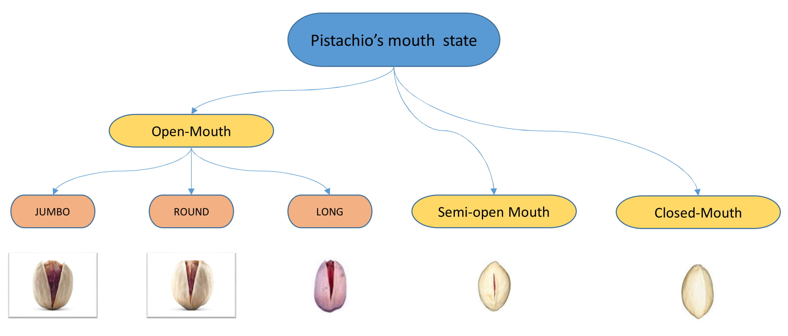
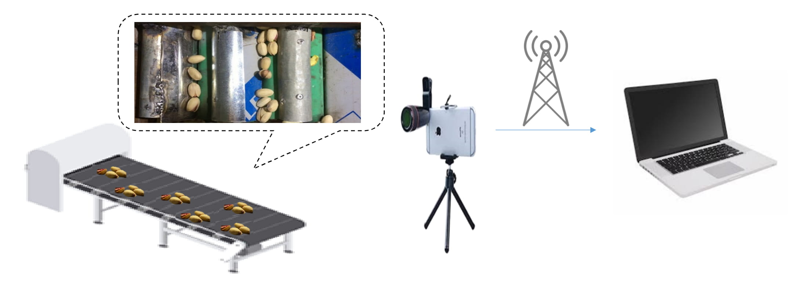

# Pesteh-Set : A New Dataset of Different Types of Pistachios

Pistachio is a nutritious nut that has many uses in the food industry. Iran is one of its largest producers, and pistachio is considered as a strategic export product for this country. This product has a great variety, most of which are cultivated in Iran and taken to other countries. Pistachios are sorted based on the shape of their shell into two categories: Open-mouth and Closed-mouth. The open-mouth pistachios are higher in price, value, and demand than the closed-mouth pistachios.

In the countries that are famous in pistachio production and exporting, there are companies that pack the picked pistachios from the trees and make them ready for exporting. As there are differences between the price and the demand of the open-mouth and closed-mouth pistachios, it is considerable for these companies to know precisely how much of these two kinds of pistachios exist in each packed package. We have introduced and shared a new dataset of pistachios, which we named Pesteh-Set. Pistachio is known as Pesteh in Iran, and that is why we called our dataset Pesteh-Set. 

	
	 
	<em>Pistachios Assortment</em>

The videos of the dataset have been recorded by a cell-phone camera with 1920 × 1080 pixels resolution, four of these videos are recorded with 60 frames per second(fps) frame rate, and one other is recorded with 30 fps frame rate. The cell-phone was perched on the wall above the line that was transporting the pistachios. This line was designed somehow that the pistachios could roll on it. The reason the pistachios rolling is so important is that the open-mouth pistachios could appear on their backside where they look like closed-mouth pistachios, but the rolling cause them to show their open-mouth side when rolling. Next figure presents a view of how the dataset was recorded, and also the general schematic of our proposed method for remote counting the pistachios.

	
	 
	<em>The General View of how Pesteh-Set was recoreded and our proposed way for counting the pistachios</em>

Pesteh-Set is made of two parts. The first part includes 423 images with ground truth. We sorted the pistachios into two classes: Open-mouth and closed-mouth. The ground truth of the images is a CSV file that consists of the bounding boxes of the two classes of pistachios in the images.
There are between 1 to 27 pistachios in each image, and 3927 pistachios totally. The second part includes 6 videos with a total length of 164 seconds and 561 moving pistachios.

We have selected some frames of the videos and labeled them with a self-developed program using OpenCV library on python language. The images of the dataset were resized to 1070 × 600 pixels to save computing costs.
Some of the images of this dataset are presented in the figure below:

 
  

The self-developed program for labeling the images along all the codes designed for preparing and visualzing the data is avaialbe on this repository. We hope that researchers could use them to make the Pistachio-Dataset larger.

The detaols of the Pesteh-Set is listed in the nex table.

Data  | Open-Mouth Pistachios | Closed-Mouth Pistachios | ALL the Pistachios
------------ | ------------- | ------------- | -------------
Video1 | 50 | 20 | 70
Video2 | 60 | 20 | 80
Video3 | 70 | 20 | 90
Video4 | 90 | 20 | 110
Video5 | 100 | 20 | 120
Video6 | 39 | 52 | 91
All of the Videos | 409 | 152 | 561
All the 423 Labeld Images | 1993 | 1934 | 3927

**The Pesteh-Set images is available in the pesteh_set_images folder.
**The Videos of Pesteh-Set is shared on https://drive.google.com/drive/folders/1ojq1maRM82o3Ee4cOUelNFKqTXda_ovs?usp=sharing**
**In this reposotory you can use the frame_generator.py to extract the frames of the videos.**
**You can also use Label_maker to label you images and make more data.**

